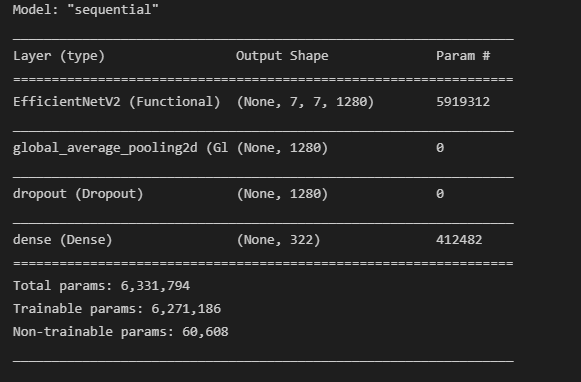
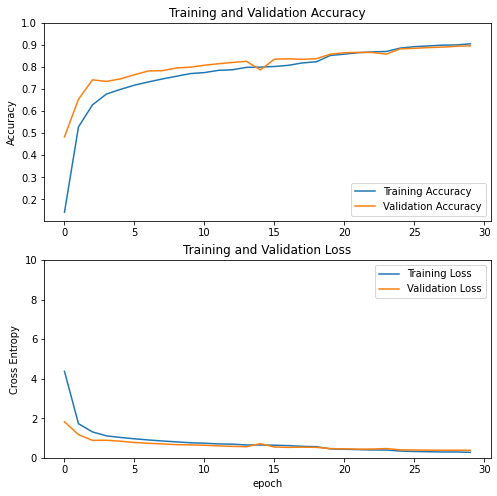

# NEXTLab Car Detection Project

## 참여자
- Jeongtae Shin(<a href="https://github.com/Klassikcat">@Klassikcat</a>): Project Management, Model build, Engineering
- Jaewoong Lee(<a href="https://github.com/colin19950703">@colin19950703</a>): Augmentation, Model build, Engineering
- Hongkyun Kim(<a href="https://github.com/ghdrbs0302">@ghdrbs0302</a>): Data Inspection, Test data Labeling, Engineering

## 구조
````Python
NEXTLab-CNN-EfficientNet
┖ core
  ┖ config.py               # Configuration.
  ┖ utils.py                # Util 함수.

┖ 
  EfficientNet.ipynb        # 전체 코드 주피터 노트북 버전. 경로 수정 필요.
  launcher_augument.py      # 이미지 증강 실행.
  launcher_classname.py     # 이미지 클래스(레이블) 생성 실행.
  main.py                   # EfficientNetv2 학습.
  models.py                 # EfficientNetv2 모델 코드.
  test.py                   # 학습된 모델 테스트 코드.
readme.md
````

## 모델 다운로드 링크
<a href="https://drive.google.com/file/d/1oyqjqkJCoOauqaftaJVsGL8PYKGH62xY/view?usp=sharing"> https://drive.google.com/file/d/1oyqjqkJCoOauqaftaJVsGL8PYKGH62xY/view?usp=sharing </a>


## 데이터 설명
### Train/Validatation Data
- AI 허브의 "자동차 차종/연식/번호판 인식용 영상" 사용: <a href="https://aihub.or.kr/aidata/27727"> https://aihub.or.kr/aidata/27727 </a>
- "세단", "SUB", "해치백", "승합" 중 322개의 클래스만을 사용.
- 데이터 불균형 해소를 위해 클래스 당 100, 300장의 이미지가 되도록 이미지 증강 사용.  

### Test Data
- NEXTLab에서 제공한 도로 CCTV 영상 : https://www.nextlab.ai/
- 80개의 클래스로 이루어진 5016개의 영상 (비공개)

## Model Structure
</a>
- EfficientNetB0 모델 사용.

## 결과

## Train_validation accuracy/loss

### Top 1 accuracy/loss
- train: 0.9051/0.2755 
- valid: 0.8960/0.3769

### top 3 accuracy
- train: 0.9880
- valid: 0.9717



## 문제점 및 개선사항
[ ] Resize하기 전의 차량 이미지 정보를 받아 비슷한 차량 모델의 크기를 비교해 구분 ex) K3, K7 

[ ] 전수 검사를 통해 클래스(레이블) 오분류 수정
